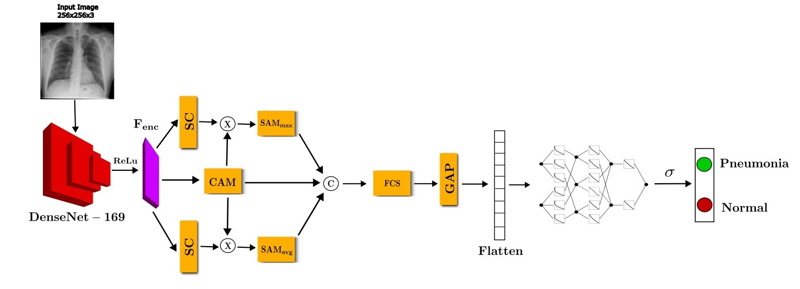

# JAM-net: a KAN-based Deep Neural Network for Pneumonia Detection in Chest X-Rays 

JAM-net (**Jacopo and Massimo Network**) is a deep neural network for pneumonia detection in **Chest X-Rays** [1]. It's based on **FA-net** [2] architecture and on **KAN (Kolmogorov–Arnold Networks)** [3].
In particular, it's composed by the "**Fuzzy Channel Selective Spatial Attention Module**" of the FA-net [2] and the KAN architecture [3] that substitute the MLP layer at the end.

# Installation

# Project Structure 

# Dataset
For the training phase, we have used the [Kermany dataset](https://data.mendeley.com/datasets/rscbjbr9sj/2). It's formed by **5856** chest X-Rays images divided in “**Normal**” and “**Pneumonia**” classes.
The images are of different sized and the dataset is unbalanced, for this reason the code firstly resize the image and after augment the dataset.

# Filtering
As in the literature [1], we have performed a preprocessing operation on images applying **Gaussian**, **Gaussian + Histogram Equalization** filtering and **Colormap** application to the images.

# Results
The training of the network is done with a **batch_size=48**, **early_stopping** monitoring the validation loss with a **threshold = 1e-4** and a **patience = 2**, the optimizer is **AdamW** with a **lr = 0.0001** and finally the loss function is the **Binary Cross Entropy Loss**. The metrics that we measure to validate the model are **Accuracy**, **Precision**, **Recall**, **AUROC** and **F1-Score**. We compare the results with the SOTA model [2] in the best preprocessing that is the 
**Gaussian + He** technique: 

**Performances in Gaussian + He**

**Confusion Matrix in Gaussian + He**

**Loss Function**

**Accuracy**

# References
[1]. [Review on chest pathogies detection systems using deep learning techniques](https://link.springer.com/article/10.1007/s10462-023-10457-9#Abs1).

[2]. [FA-Net: A Fuzzy Attention-aided Deep Neural Network for Pneumonia Detection in Chest X-Rays](https://arxiv.org/pdf/2406.15117).

[3]. [KAN: Kolmogorov–Arnold Networks](https://arxiv.org/pdf/2404.19756).
